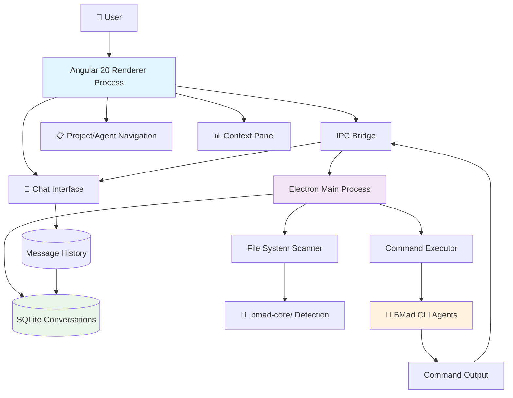
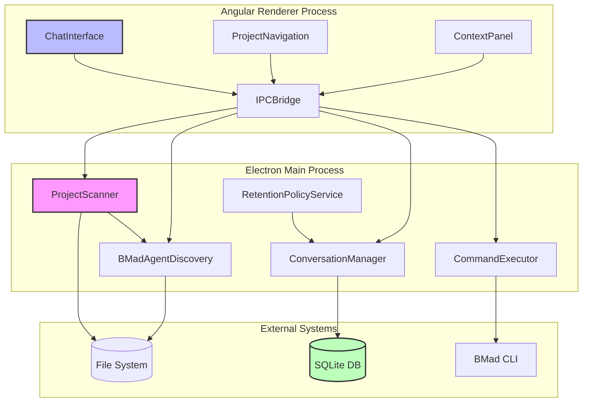
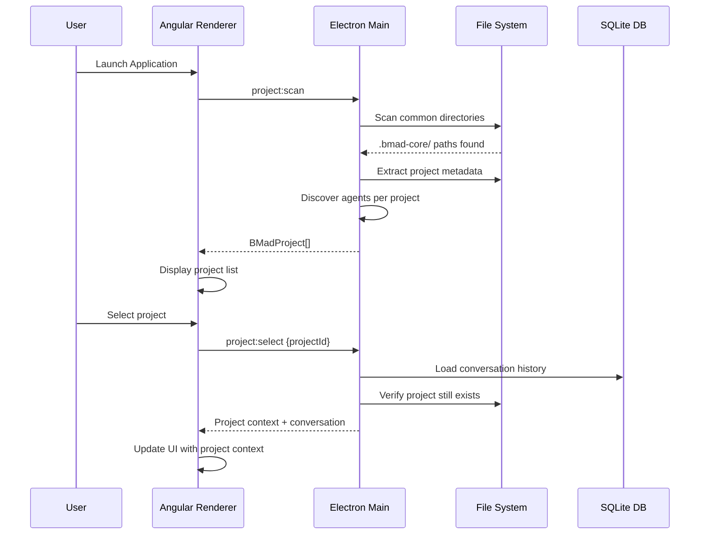
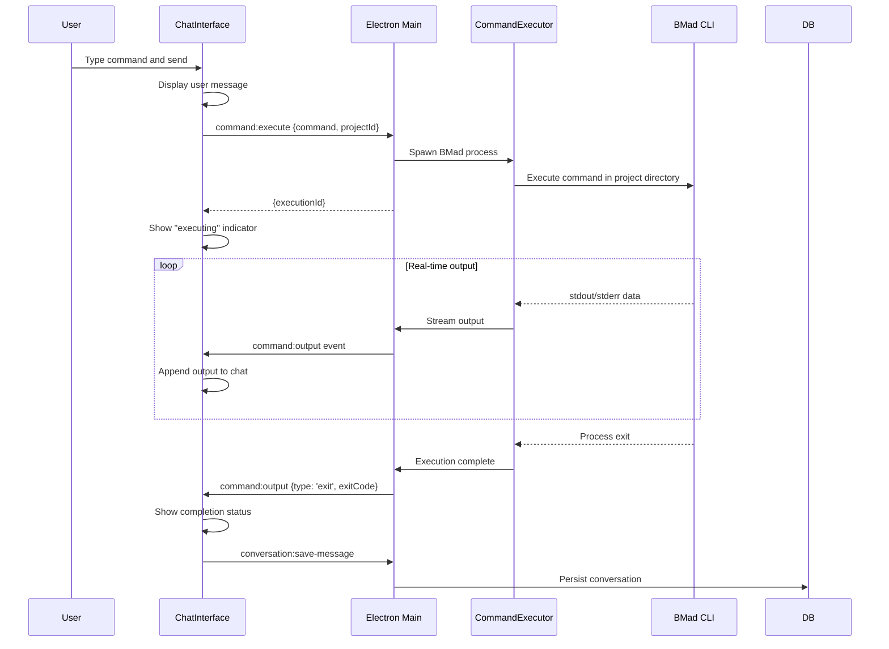
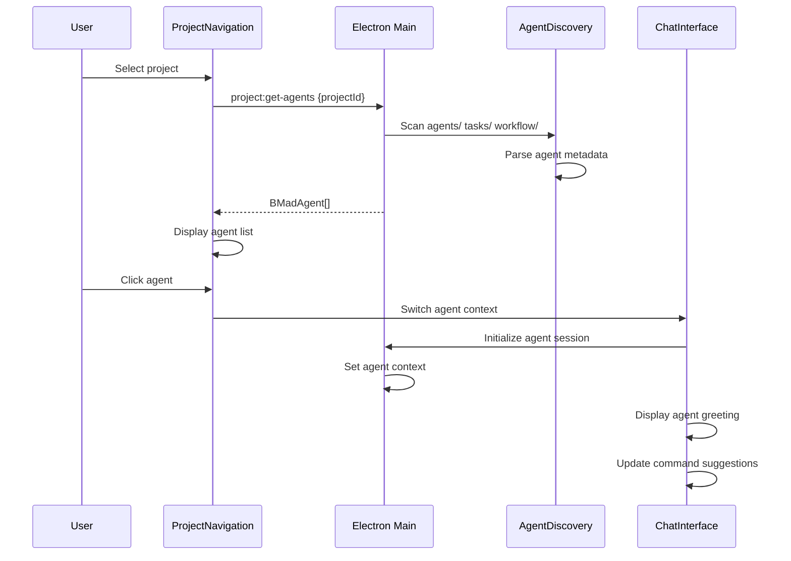
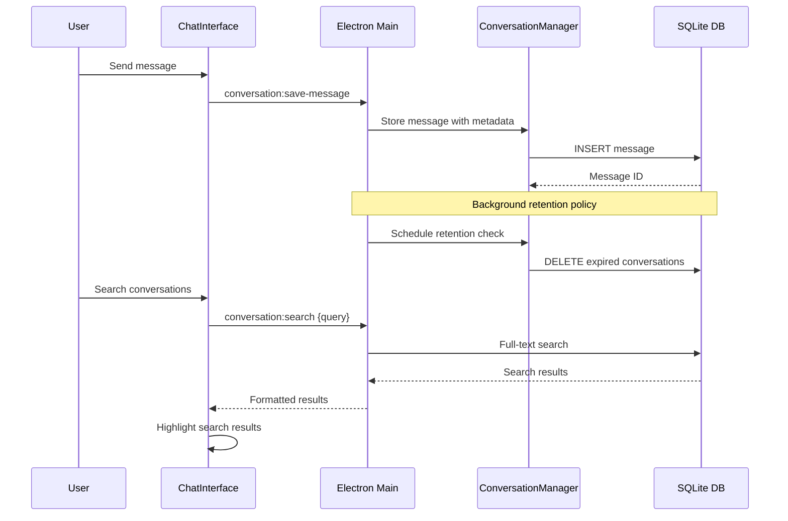
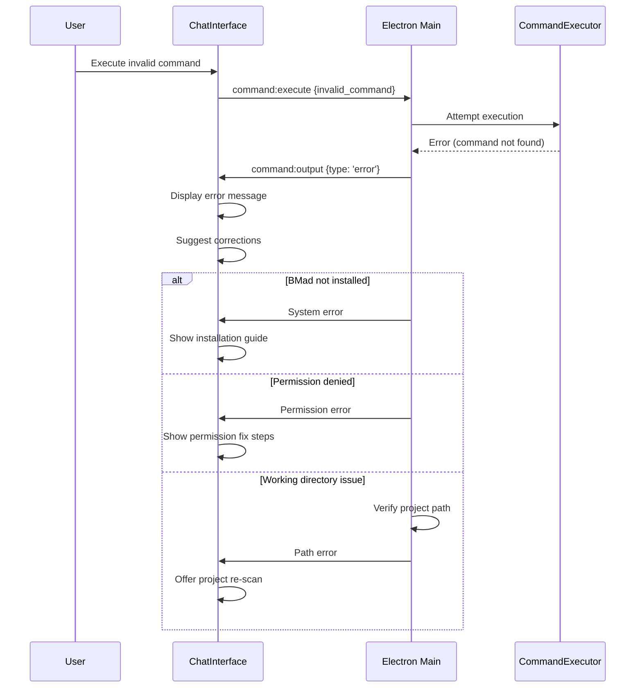
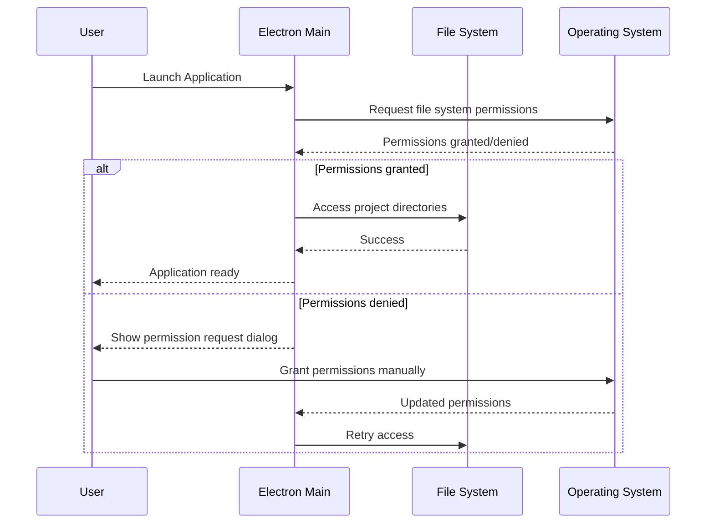
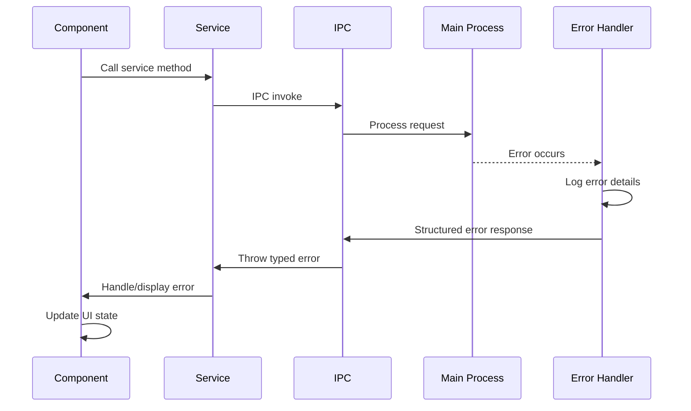

# BMad GUI Fullstack Architecture Document

## Introduction

This document outlines the complete fullstack architecture for **BMad GUI**, including the Electron main process backend, Angular 20 frontend implementation, and their integration. It serves as the single source of truth for AI-driven development, ensuring consistency across the entire technology stack.

This unified approach combines what would traditionally be separate backend and frontend architecture documents, streamlining the development process for this modern desktop application where these concerns are increasingly intertwined through Electron's architecture.

### Starter Template or Existing Project

**N/A - Greenfield project**

The BMad GUI is being built from scratch as a greenfield desktop application. However, I recommend considering modern Electron + Angular starters to accelerate development:

- **Electron + Angular Template**: Consider using `electron-builder` with Angular CLI for streamlined setup
- **Cross-Platform Desktop Starters**: Templates like `electron-forge` with Angular integration
- **TypeScript Desktop Templates**: Pre-configured setups with Angular signals and standalone components

Given your aggressive 2-4 week timeline, using a proven Electron + Angular starter template could save significant setup time while ensuring best practices are followed from the start.

### Change Log

| Date | Version | Description | Author |
|------|---------|-------------|---------|
| 2025-09-15 | 1.0 | Initial architecture document creation | Winston (Architect) |

## High Level Architecture

### Technical Summary

BMad GUI employs a native desktop architecture using Electron with Angular 20+ for the renderer process, creating a hybrid application that bridges local system access with modern web UI capabilities. The frontend leverages Angular's standalone components, signals, and @defer blocks for reactive chat interfaces, while the Electron main process manages BMad CLI integration, file system operations, and SQLite conversation persistence. Key integration occurs through IPC channels that maintain working directory context and enable real-time command execution feedback. The application deploys as a cross-platform native desktop app (Windows, macOS, Linux) with complete offline capability and local-first data storage. This architecture directly addresses workflow fragmentation by unifying CLI power with conversational UX while maintaining the privacy guarantees essential for competitive development work.

### Platform and Infrastructure Choice

Based on your PRD requirements for cross-platform desktop application with local-first architecture, I'm recommending the **Desktop Native + Local Services** approach:

**Platform:** Native Desktop Application (Electron)
**Key Services:**
- Electron main process (Node.js runtime)
- Angular 20+ renderer process
- SQLite local databases per project
- File system APIs for project detection
- Child process management for BMad execution

**Deployment Host and Regions:** Local desktop deployment with distributed binaries via GitHub Releases or similar. No server infrastructure required - each installation is completely self-contained.

**Alternative considered but not recommended:**
- **Web Application**: Would require server infrastructure and compromise offline capability
- **Progressive Web App**: Lacks file system access needed for BMad integration

### Repository Structure

**Structure:** Monorepo with clear service separation
**Monorepo Tool:** npm workspaces (built into npm, no additional tooling required)
**Package Organization:**
- `apps/desktop` - Main Electron application
- `libs/shared` - Shared TypeScript interfaces and utilities
- `libs/bmad-integration` - BMad CLI integration layer
- `libs/conversation-storage` - SQLite conversation management

This structure supports your single-developer timeline while enabling future modularization if needed.

### High Level Architecture Diagram



### Architectural Patterns

- **Desktop Native Architecture:** Electron provides native OS integration while maintaining web technology benefits - _Rationale:_ Balances development speed with native desktop capabilities required for file system access
- **Reactive UI with Signals:** Angular signals for state management with RxJS for async operations - _Rationale:_ Optimal performance for real-time chat interfaces and command execution feedback
- **Local-First Data Storage:** SQLite per-project with no external dependencies - _Rationale:_ Ensures privacy guarantees and offline capability essential for competitive development work
- **Process Separation Pattern:** Main process handles system integration, renderer focuses on UI - _Rationale:_ Leverages Electron's security model while enabling rich UI interactions
- **Command Execution Context Preservation:** Maintain working directory state across command invocations - _Rationale:_ Essential for BMad CLI compatibility and user workflow continuity
- **IPC Message Queuing:** Structured communication between processes with error handling - _Rationale:_ Ensures reliable command execution and real-time UI updates

## Tech Stack

This is the DEFINITIVE technology selection for the entire BMad GUI project. All development must use these exact versions and approaches.

### Technology Stack Table

| Category | Technology | Version | Purpose | Rationale |
|----------|------------|---------|---------|-----------|
| Frontend Language | TypeScript | 5.2+ | Type-safe Angular development | Provides compile-time safety essential for single developer, reduces runtime errors |
| Frontend Framework | Angular | 20+ | Reactive UI with standalone components | Signals and @defer blocks optimize chat performance, standalone components reduce bundle size |
| UI Component Library | Angular Material | 17+ | Consistent desktop UI patterns | Mature component library with accessibility built-in, reduces custom CSS needs |
| State Management | Angular Signals | Built-in | Reactive state for chat/commands | Native Angular solution, optimal performance for real-time updates |
| Backend Language | Node.js | 18+ LTS | Electron main process runtime | Required for Electron, provides access to system APIs |
| Backend Framework | Electron | 27+ | Cross-platform desktop packaging | Only viable option for cross-platform native desktop with web technologies |
| API Style | IPC (Inter-Process Communication) | Built-in | Main/renderer communication | Electron's native communication method, no HTTP needed for local app |
| Database | SQLite | 3.40+ | Local conversation storage | Zero-config local database, perfect for offline-first architecture |
| Cache | Memory (Map) | Built-in | Runtime command/project cache | Simple in-memory caching sufficient for desktop app scope |
| File Storage | File System API | Native | Project detection and logs | Native file system access required for .bmad-core/ detection |
| Authentication | None | N/A | No auth required for local app | Local-only application eliminates authentication complexity |
| Frontend Testing | Jest + Angular Testing | Latest | Unit and component testing | Angular's default testing setup, minimal configuration required |
| Backend Testing | Jest | Latest | Node.js service testing | Consistent testing framework across frontend/backend |
| E2E Testing | Deferred to post-MVP | N/A | End-to-end workflow testing | Manual testing sufficient for MVP timeline |
| Build Tool | Angular CLI | 17+ | Frontend build and dev server | Integrated build pipeline optimized for Angular development |
| Bundler | Webpack (via Angular CLI) | Latest | Code bundling and optimization | Built into Angular CLI, handles both dev and production builds |
| IaC Tool | None | N/A | No infrastructure required | Desktop app eliminates infrastructure management |
| CI/CD | GitHub Actions | Latest | Build and release automation | Free for open source, cross-platform builds |
| Monitoring | Console logging | Built-in | Development debugging | Simple logging sufficient for MVP, can enhance post-launch |
| Logging | Electron Log | 5+ | Structured desktop app logging | Desktop-optimized logging with file rotation |
| CSS Framework | Angular Material + Custom | Latest | Styling and layout | Material provides base, custom CSS for chat-specific styling |

## Data Models

Based on your PRD requirements, I'm defining the core data models that will be shared between the Electron main process and Angular renderer:

### BMadProject

**Purpose:** Represents a detected BMad project with its metadata and current state

**Key Attributes:**
- id: string - Unique identifier derived from project path
- name: string - Project name (directory name)
- path: string - Absolute path to project directory
- lastAccessed: Date - When project was last opened
- agents: BMadAgent[] - Available agents discovered in project

#### TypeScript Interface
```typescript
interface BMadProject {
  id: string;
  name: string;
  path: string;
  lastAccessed: Date;
  agents: BMadAgent[];
  isActive: boolean;
}
```

#### Relationships
- Has many BMadAgent
- Has many Conversation
- Has one ProjectContext

### BMadAgent

**Purpose:** Represents an available BMad agent within a project context

**Key Attributes:**
- id: string - Unique agent identifier
- name: string - Human-readable agent name
- type: AgentType - Category (task, workflow, specialist)
- description: string - Agent capabilities description
- projectId: string - Parent project reference

#### TypeScript Interface
```typescript
interface BMadAgent {
  id: string;
  name: string;
  type: 'task' | 'workflow' | 'specialist';
  description?: string;
  projectId: string;
  lastUsed?: Date;
}
```

#### Relationships
- Belongs to BMadProject
- Can be referenced by Message

### Conversation

**Purpose:** Represents a chat conversation within a project context with persistence

**Key Attributes:**
- id: string - Unique conversation identifier
- projectId: string - Associated project
- title: string - Conversation title (auto-generated)
- createdAt: Date - Conversation start time
- updatedAt: Date - Last message time
- messages: Message[] - All messages in conversation

#### TypeScript Interface
```typescript
interface Conversation {
  id: string;
  projectId: string;
  title: string;
  createdAt: Date;
  updatedAt: Date;
  messages: Message[];
  retentionDate?: Date;
}
```

#### Relationships
- Belongs to BMadProject
- Has many Message
- Subject to RetentionPolicy

### Message

**Purpose:** Individual chat messages with rich content and metadata

**Key Attributes:**
- id: string - Unique message identifier
- conversationId: string - Parent conversation
- type: MessageType - User, AI, system, command output
- content: string - Message text content
- timestamp: Date - Message creation time
- metadata: MessageMetadata - Additional structured data

#### TypeScript Interface
```typescript
interface Message {
  id: string;
  conversationId: string;
  type: 'user' | 'ai' | 'system' | 'command-output' | 'error';
  content: string;
  timestamp: Date;
  metadata?: {
    agentId?: string;
    commandExitCode?: number;
    isStreaming?: boolean;
    executionTime?: number;
  };
}
```

#### Relationships
- Belongs to Conversation
- May reference BMadAgent

### CommandExecution

**Purpose:** Tracks BMad command execution state and results

**Key Attributes:**
- id: string - Unique execution identifier
- messageId: string - Associated message
- command: string - Executed command
- status: ExecutionStatus - Current execution state
- output: string - Command output (stdout/stderr)
- exitCode: number - Process exit code

#### TypeScript Interface
```typescript
interface CommandExecution {
  id: string;
  messageId: string;
  command: string;
  status: 'pending' | 'running' | 'completed' | 'failed' | 'cancelled';
  output?: string;
  error?: string;
  exitCode?: number;
  startTime: Date;
  endTime?: Date;
}
```

#### Relationships
- Belongs to Message
- Tracked by ExecutionService

## API Specification

Since BMad GUI uses IPC (Inter-Process Communication) rather than REST API, I'm providing the IPC channel definitions that serve as the "API" between the Electron main process and Angular renderer.

### IPC Channel Definitions

```typescript
// IPC Channel Types and Messages
interface IPCChannelMap {
  // Project Management
  'project:scan': {
    request: { paths?: string[] };
    response: BMadProject[];
  };

  'project:select': {
    request: { projectId: string };
    response: { success: boolean; project?: BMadProject };
  };

  'project:get-agents': {
    request: { projectId: string };
    response: BMadAgent[];
  };

  // Command Execution
  'command:execute': {
    request: {
      projectId: string;
      command: string;
      agentId?: string;
    };
    response: { executionId: string };
  };

  'command:output': {
    event: {
      executionId: string;
      type: 'stdout' | 'stderr' | 'exit';
      data: string;
      exitCode?: number;
    };
  };

  'command:cancel': {
    request: { executionId: string };
    response: { success: boolean };
  };

  // Conversation Management
  'conversation:load': {
    request: { projectId: string; conversationId?: string };
    response: Conversation;
  };

  'conversation:save-message': {
    request: {
      conversationId: string;
      message: Omit<Message, 'id' | 'timestamp'>;
    };
    response: { messageId: string };
  };

  'conversation:search': {
    request: {
      projectId: string;
      query: string;
      filters?: {
        dateRange?: { start: Date; end: Date };
        messageTypes?: string[];
      };
    };
    response: {
      results: Array<{
        messageId: string;
        conversationId: string;
        snippet: string;
        timestamp: Date;
      }>;
    };
  };

  // Settings and Preferences
  'settings:get': {
    request: { key?: string };
    response: Record<string, any>;
  };

  'settings:set': {
    request: { settings: Record<string, any> };
    response: { success: boolean };
  };
}

// Example IPC Service Implementation
class IPCService {
  // Main Process -> Renderer Events
  static sendToRenderer(channel: keyof IPCChannelMap, data: any): void;

  // Renderer -> Main Process Requests
  static invoke<T extends keyof IPCChannelMap>(
    channel: T,
    data: IPCChannelMap[T]['request']
  ): Promise<IPCChannelMap[T]['response']>;

  // Event Listeners
  static on<T extends keyof IPCChannelMap>(
    channel: T,
    handler: (data: IPCChannelMap[T]['event']) => void
  ): void;
}
```

**Example Usage Patterns:**

```typescript
// In Angular Service
async loadProject(projectId: string): Promise<BMadProject> {
  const response = await IPCService.invoke('project:select', { projectId });
  if (response.success && response.project) {
    return response.project;
  }
  throw new Error('Project not found');
}

// Command execution with real-time output
async executeCommand(projectId: string, command: string): Promise<void> {
  const { executionId } = await IPCService.invoke('command:execute', {
    projectId,
    command
  });

  IPCService.on('command:output', (event) => {
    if (event.executionId === executionId) {
      this.handleCommandOutput(event);
    }
  });
}
```

**Authentication:** Not applicable - IPC communication is internal to the application

**Error Handling:** All IPC calls include error responses with structured error information:

```typescript
interface IPCError {
  code: string;
  message: string;
  details?: Record<string, any>;
}
```

## Components

Based on the architectural patterns, tech stack choices, and data models, here are the major logical components across the BMad GUI fullstack:

### ProjectScanner

**Responsibility:** Automatically discover BMad projects by scanning file system for `.bmad-core/` directories and extracting project metadata

**Key Interfaces:**
- `scanForProjects(paths: string[]): Promise<BMadProject[]>`
- `watchProjectChanges(): Observable<ProjectChange>`

**Dependencies:** File System API, BMadAgentDiscovery

**Technology Stack:** Node.js file system APIs in Electron main process, with recursive directory scanning and file watching capabilities

### BMadAgentDiscovery

**Responsibility:** Discover available agents within projects by scanning `agents/`, `tasks/`, and `workflow/` directories

**Key Interfaces:**
- `discoverAgents(projectPath: string): Promise<BMadAgent[]>`
- `getAgentMetadata(agentPath: string): Promise<AgentMetadata>`

**Dependencies:** File System API, ProjectScanner

**Technology Stack:** Node.js file parsing with YAML/JSON metadata extraction for agent definitions

### CommandExecutor

**Responsibility:** Execute BMad CLI commands in proper working directory context with real-time output streaming

**Key Interfaces:**
- `executeCommand(command: string, projectPath: string): Promise<CommandExecution>`
- `streamOutput(): Observable<CommandOutput>`
- `cancelExecution(executionId: string): void`

**Dependencies:** Node.js child_process, ProjectContext

**Technology Stack:** Node.js child_process.spawn with stdio streaming, process management, and cross-platform command handling

### ConversationManager

**Responsibility:** Handle SQLite conversation persistence, message storage, and retention policy enforcement

**Key Interfaces:**
- `saveMessage(message: Message): Promise<string>`
- `loadConversation(conversationId: string): Promise<Conversation>`
- `searchMessages(query: SearchQuery): Promise<SearchResults>`

**Dependencies:** SQLite database, RetentionPolicyService

**Technology Stack:** SQLite with node-sqlite3 binding, prepared statements, and full-text search capabilities

### ChatInterface

**Responsibility:** Angular component managing the message bubble UI, user input, and real-time message display

**Key Interfaces:**
- `sendMessage(content: string): void`
- `displayMessage(message: Message): void`
- `handleCommandOutput(output: CommandOutput): void`

**Dependencies:** MessageService, CommandService, Angular Material

**Technology Stack:** Angular 20+ standalone component with signals, @defer blocks for message virtualization, Angular Material for UI components

### ProjectNavigation

**Responsibility:** Left sidebar component for project selection, agent discovery, and navigation state management

**Key Interfaces:**
- `loadProjects(): void`
- `selectProject(projectId: string): void`
- `displayAgents(agents: BMadAgent[]): void`

**Dependencies:** ProjectService, AgentService, Router

**Technology Stack:** Angular standalone component with Angular Material navigation components and reactive signals

### IPCBridge

**Responsibility:** Facilitate secure communication between Angular renderer and Electron main process

**Key Interfaces:**
- `invoke<T>(channel: string, data: any): Promise<T>`
- `on<T>(channel: string, handler: (data: T) => void): void`
- `send(channel: string, data: any): void`

**Dependencies:** Electron IPC, Angular services

**Technology Stack:** Electron contextBridge API with type-safe IPC wrapper and Angular service integration

### RetentionPolicyService

**Responsibility:** Enforce conversation retention policies and manage database cleanup operations

**Key Interfaces:**
- `enforceRetention(projectId: string): Promise<void>`
- `markForDeletion(conversationId: string): void`
- `scheduleCleanup(): void`

**Dependencies:** ConversationManager, SettingsService

**Technology Stack:** Node.js scheduling with cron-like functionality, SQLite batch operations for efficient cleanup

## Component Diagrams



## External APIs

**No external APIs are required for BMad GUI core functionality.**

This is a deliberate architectural decision that aligns with your PRD requirements for complete offline capability and local-first privacy. The application achieves full functionality through:

- **BMad CLI Integration**: Direct process spawning rather than API calls
- **Local File System**: Native file system APIs for project detection
- **SQLite Storage**: Local database eliminates need for remote data APIs
- **Offline-First Design**: All features work without network connectivity

**Future Considerations (Post-MVP):**
If external APIs become necessary for enhanced features, potential integrations might include:
- GitHub API for repository integration (optional enhancement)
- Update checking service for application updates (can be implemented via GitHub Releases)
- Telemetry APIs for usage analytics (opt-in only, maintaining privacy-first approach)

This zero-external-dependency approach directly supports your competitive positioning as a privacy-first development tool and ensures the application works reliably in restrictive network environments.

## Core Workflows

### Project Discovery and Selection Workflow



### Command Execution and Real-time Output



### Agent Discovery and Switching



### Conversation Persistence and History



### Error Handling and Recovery



## Database Schema

Transforming the conceptual data models into concrete SQLite database schemas for per-project conversation storage:

```sql
-- SQLite Schema for BMad GUI Conversation Database
-- Each project gets its own .bmad-gui/conversations.db

-- Projects table (minimal, mostly for referential integrity)
CREATE TABLE projects (
    id TEXT PRIMARY KEY,
    name TEXT NOT NULL,
    path TEXT NOT NULL UNIQUE,
    created_at DATETIME DEFAULT CURRENT_TIMESTAMP,
    last_accessed DATETIME DEFAULT CURRENT_TIMESTAMP
);

-- Conversations table
CREATE TABLE conversations (
    id TEXT PRIMARY KEY,
    project_id TEXT NOT NULL,
    title TEXT NOT NULL,
    created_at DATETIME DEFAULT CURRENT_TIMESTAMP,
    updated_at DATETIME DEFAULT CURRENT_TIMESTAMP,
    retention_date DATETIME,
    is_pinned BOOLEAN DEFAULT FALSE,
    FOREIGN KEY (project_id) REFERENCES projects(id) ON DELETE CASCADE
);

-- Messages table with full-text search capability
CREATE TABLE messages (
    id TEXT PRIMARY KEY,
    conversation_id TEXT NOT NULL,
    type TEXT NOT NULL CHECK (type IN ('user', 'ai', 'system', 'command-output', 'error')),
    content TEXT NOT NULL,
    timestamp DATETIME DEFAULT CURRENT_TIMESTAMP,
    agent_id TEXT,
    command_exit_code INTEGER,
    is_streaming BOOLEAN DEFAULT FALSE,
    execution_time_ms INTEGER,
    FOREIGN KEY (conversation_id) REFERENCES conversations(id) ON DELETE CASCADE
);

-- Command executions table for detailed tracking
CREATE TABLE command_executions (
    id TEXT PRIMARY KEY,
    message_id TEXT NOT NULL,
    command TEXT NOT NULL,
    status TEXT NOT NULL CHECK (status IN ('pending', 'running', 'completed', 'failed', 'cancelled')),
    output TEXT,
    error TEXT,
    exit_code INTEGER,
    start_time DATETIME DEFAULT CURRENT_TIMESTAMP,
    end_time DATETIME,
    FOREIGN KEY (message_id) REFERENCES messages(id) ON DELETE CASCADE
);

-- Agents discovered in project (cached for performance)
CREATE TABLE agents (
    id TEXT PRIMARY KEY,
    project_id TEXT NOT NULL,
    name TEXT NOT NULL,
    type TEXT NOT NULL CHECK (type IN ('task', 'workflow', 'specialist')),
    description TEXT,
    file_path TEXT NOT NULL,
    last_used DATETIME,
    FOREIGN KEY (project_id) REFERENCES projects(id) ON DELETE CASCADE
);

-- Settings/preferences per project
CREATE TABLE settings (
    key TEXT PRIMARY KEY,
    value TEXT NOT NULL,
    updated_at DATETIME DEFAULT CURRENT_TIMESTAMP
);

-- Indexes for performance optimization
CREATE INDEX idx_messages_conversation_timestamp ON messages(conversation_id, timestamp DESC);
CREATE INDEX idx_messages_type ON messages(type);
CREATE INDEX idx_conversations_updated ON conversations(updated_at DESC);
CREATE INDEX idx_conversations_retention ON conversations(retention_date);
CREATE INDEX idx_executions_status ON command_executions(status);
CREATE INDEX idx_agents_project ON agents(project_id);
CREATE INDEX idx_agents_last_used ON agents(last_used DESC);

-- Full-text search virtual table for message content
CREATE VIRTUAL TABLE messages_fts USING fts5(
    content,
    content='messages',
    content_rowid='rowid'
);

-- Triggers to maintain FTS index
CREATE TRIGGER messages_fts_insert AFTER INSERT ON messages BEGIN
    INSERT INTO messages_fts(rowid, content) VALUES (new.rowid, new.content);
END;

CREATE TRIGGER messages_fts_update AFTER UPDATE ON messages BEGIN
    UPDATE messages_fts SET content = new.content WHERE rowid = new.rowid;
END;

CREATE TRIGGER messages_fts_delete AFTER DELETE ON messages BEGIN
    DELETE FROM messages_fts WHERE rowid = old.rowid;
END;

-- Views for common queries
CREATE VIEW conversation_summary AS
SELECT
    c.id,
    c.title,
    c.created_at,
    c.updated_at,
    COUNT(m.id) as message_count,
    MAX(m.timestamp) as last_message_time
FROM conversations c
LEFT JOIN messages m ON c.id = m.conversation_id
GROUP BY c.id, c.title, c.created_at, c.updated_at;

CREATE VIEW recent_agents AS
SELECT
    a.*,
    COUNT(m.id) as usage_count
FROM agents a
LEFT JOIN messages m ON a.id = m.agent_id
GROUP BY a.id
ORDER BY a.last_used DESC, usage_count DESC;

-- Sample data migration script for initial setup
INSERT INTO settings (key, value) VALUES
    ('retention_days', '7'),
    ('max_conversation_count', '1000'),
    ('theme_preference', 'system'),
    ('schema_version', '1.0');
```

**Key Design Decisions:**
- **Per-project isolation**: Each project maintains its own SQLite database file
- **Full-text search**: FTS5 virtual table enables efficient conversation search
- **Retention management**: Built-in retention_date field for automated cleanup
- **Performance indexing**: Optimized for common queries (recent conversations, message history)
- **Command tracking**: Detailed execution tracking for debugging and analytics
- **Agent caching**: Local cache of discovered agents to avoid repeated file system scans

**Schema Evolution Strategy:**
- `schema_version` setting enables future migrations
- Add migration scripts for schema updates as new features are added
- Backward compatibility maintained through versioned migration system

## Frontend Architecture

### Component Architecture

#### Component Organization
```
src/app/
├── core/                    # Singleton services and guards
│   ├── services/
│   │   ├── ipc.service.ts
│   │   ├── project.service.ts
│   │   └── conversation.service.ts
│   └── guards/
├── shared/                  # Reusable components
│   ├── components/
│   │   ├── message-bubble/
│   │   ├── loading-spinner/
│   │   └── error-display/
│   └── interfaces/
├── features/                # Feature-specific modules
│   ├── chat/
│   │   ├── components/
│   │   │   ├── chat-interface/
│   │   │   ├── message-input/
│   │   │   └── message-list/
│   │   └── services/
│   ├── projects/
│   │   ├── components/
│   │   │   ├── project-list/
│   │   │   └── project-selector/
│   │   └── services/
│   └── agents/
└── layouts/                 # Layout components
    ├── main-layout/
    └── three-panel-layout/
```

#### Component Template
```typescript
@Component({
  selector: 'app-chat-interface',
  standalone: true,
  imports: [CommonModule, MatButtonModule, MatInputModule],
  template: `
    <div class="chat-container">
      <app-message-list
        [messages]="messages()"
        [isLoading]="isExecuting()" />
      <app-message-input
        (messageSubmit)="handleMessage($event)"
        [disabled]="isExecuting()" />
    </div>
  `,
  styleUrl: './chat-interface.component.scss'
})
export class ChatInterfaceComponent {
  messages = signal<Message[]>([]);
  isExecuting = signal<boolean>(false);

  constructor(
    private conversationService: ConversationService,
    private commandService: CommandService
  ) {}

  handleMessage(content: string) {
    // Implementation with signals and reactive patterns
  }
}
```

### State Management Architecture

#### State Structure
```typescript
// Global application state using Angular signals
interface AppState {
  currentProject: Signal<BMadProject | null>;
  conversations: Signal<Conversation[]>;
  activeConversation: Signal<Conversation | null>;
  availableAgents: Signal<BMadAgent[]>;
  isLoading: Signal<boolean>;
  error: Signal<string | null>;
}

// Service-based state management
@Injectable({ providedIn: 'root' })
export class StateService {
  private _currentProject = signal<BMadProject | null>(null);
  private _conversations = signal<Conversation[]>([]);
  private _activeConversation = signal<Conversation | null>(null);

  readonly currentProject = this._currentProject.asReadonly();
  readonly conversations = this._conversations.asReadonly();
  readonly activeConversation = this._activeConversation.asReadonly();

  setCurrentProject(project: BMadProject) {
    this._currentProject.set(project);
  }

  addMessage(message: Message) {
    const current = this._activeConversation();
    if (current) {
      const updated = {
        ...current,
        messages: [...current.messages, message]
      };
      this._activeConversation.set(updated);
    }
  }
}
```

#### State Management Patterns
- **Signal-based reactivity**: Use Angular signals for fine-grained reactivity
- **Service-based state**: Centralized state management through injectable services
- **Computed signals**: Derived state using computed() for optimal performance
- **Effect-based side effects**: Use effect() for handling state change reactions

### Routing Architecture

#### Route Organization
```
/
├── projects/               # Project selection view
├── chat/:projectId         # Main chat interface
├── history/:projectId      # Conversation history
├── settings               # Application settings
└── ** (redirect to projects)
```

#### Protected Route Pattern
```typescript
@Injectable()
export class ProjectGuard implements CanActivate {
  constructor(private projectService: ProjectService) {}

  canActivate(route: ActivatedRouteSnapshot): boolean {
    const projectId = route.params['projectId'];
    return this.projectService.hasProject(projectId);
  }
}

// Route configuration
export const routes: Routes = [
  { path: '', redirectTo: '/projects', pathMatch: 'full' },
  { path: 'projects', component: ProjectListComponent },
  {
    path: 'chat/:projectId',
    component: ChatLayoutComponent,
    canActivate: [ProjectGuard]
  },
  {
    path: 'history/:projectId',
    component: ConversationHistoryComponent,
    canActivate: [ProjectGuard]
  }
];
```

### Frontend Services Layer

#### API Client Setup
```typescript
@Injectable({ providedIn: 'root' })
export class IPCService {
  async invoke<T extends keyof IPCChannelMap>(
    channel: T,
    data: IPCChannelMap[T]['request']
  ): Promise<IPCChannelMap[T]['response']> {
    return (window as any).electronAPI.invoke(channel, data);
  }

  on<T extends keyof IPCChannelMap>(
    channel: T,
    handler: (data: IPCChannelMap[T]['event']) => void
  ): void {
    (window as any).electronAPI.on(channel, handler);
  }

  removeListener(channel: string, handler: Function): void {
    (window as any).electronAPI.removeListener(channel, handler);
  }
}
```

#### Service Example
```typescript
@Injectable({ providedIn: 'root' })
export class ConversationService {
  constructor(private ipc: IPCService) {}

  async loadConversation(projectId: string, conversationId?: string): Promise<Conversation> {
    return this.ipc.invoke('conversation:load', { projectId, conversationId });
  }

  async saveMessage(conversationId: string, message: Omit<Message, 'id' | 'timestamp'>): Promise<string> {
    const result = await this.ipc.invoke('conversation:save-message', {
      conversationId,
      message
    });
    return result.messageId;
  }

  async searchConversations(projectId: string, query: string): Promise<SearchResult[]> {
    const result = await this.ipc.invoke('conversation:search', {
      projectId,
      query
    });
    return result.results;
  }
}
```

## Backend Architecture

### Service Architecture (Serverless/Function-based via Electron Main Process)

#### Function Organization
```
src/main/
├── services/               # Core business logic services
│   ├── project-scanner.ts
│   ├── agent-discovery.ts
│   ├── command-executor.ts
│   └── conversation-manager.ts
├── handlers/               # IPC message handlers
│   ├── project-handlers.ts
│   ├── command-handlers.ts
│   └── conversation-handlers.ts
├── utils/                  # Shared utilities
│   ├── file-utils.ts
│   ├── process-utils.ts
│   └── database-utils.ts
└── main.ts                # Electron main entry point
```

#### Function Template
```typescript
// Electron main process service
export class CommandExecutorService {
  private activeExecutions = new Map<string, ChildProcess>();

  async executeCommand(
    projectId: string,
    command: string,
    agentId?: string
  ): Promise<{ executionId: string }> {
    const executionId = generateId();
    const projectPath = await this.getProjectPath(projectId);

    const childProcess = spawn(command, {
      cwd: projectPath,
      shell: true,
      stdio: ['pipe', 'pipe', 'pipe']
    });

    this.activeExecutions.set(executionId, childProcess);

    // Stream output to renderer
    childProcess.stdout?.on('data', (data) => {
      this.sendToRenderer('command:output', {
        executionId,
        type: 'stdout',
        data: data.toString()
      });
    });

    childProcess.stderr?.on('data', (data) => {
      this.sendToRenderer('command:output', {
        executionId,
        type: 'stderr',
        data: data.toString()
      });
    });

    childProcess.on('exit', (code) => {
      this.sendToRenderer('command:output', {
        executionId,
        type: 'exit',
        data: '',
        exitCode: code ?? -1
      });
      this.activeExecutions.delete(executionId);
    });

    return { executionId };
  }

  cancelExecution(executionId: string): boolean {
    const process = this.activeExecutions.get(executionId);
    if (process) {
      process.kill('SIGTERM');
      this.activeExecutions.delete(executionId);
      return true;
    }
    return false;
  }
}
```

### Database Architecture

#### Schema Design
```sql
-- Already defined in Database Schema section above
-- This section references the SQLite schema for consistency
```

#### Data Access Layer
```typescript
// Repository pattern for database access
export class ConversationRepository {
  constructor(private db: sqlite3.Database) {}

  async saveMessage(message: Omit<Message, 'id'>): Promise<string> {
    const id = generateId();
    const stmt = this.db.prepare(`
      INSERT INTO messages (id, conversation_id, type, content, timestamp, agent_id, command_exit_code)
      VALUES (?, ?, ?, ?, ?, ?, ?)
    `);

    return new Promise((resolve, reject) => {
      stmt.run([
        id,
        message.conversationId,
        message.type,
        message.content,
        message.timestamp.toISOString(),
        message.metadata?.agentId || null,
        message.metadata?.commandExitCode || null
      ], function(err) {
        if (err) reject(err);
        else resolve(id);
      });
    });
  }

  async searchMessages(projectId: string, query: string): Promise<SearchResult[]> {
    const stmt = this.db.prepare(`
      SELECT m.id, m.conversation_id, m.content, m.timestamp,
             snippet(messages_fts, 0, '<mark>', '</mark>', '...', 64) as snippet
      FROM messages_fts
      JOIN messages m ON messages_fts.rowid = m.rowid
      JOIN conversations c ON m.conversation_id = c.id
      WHERE messages_fts MATCH ? AND c.project_id = ?
      ORDER BY rank
      LIMIT 50
    `);

    return new Promise((resolve, reject) => {
      stmt.all([query, projectId], (err, rows) => {
        if (err) reject(err);
        else resolve(rows as SearchResult[]);
      });
    });
  }
}
```

### Authentication and Authorization

Since this is a local desktop application, traditional authentication is not required. However, we implement security measures:

#### Auth Flow


#### Middleware/Guards
```typescript
// Security service for validating file system access
export class SecurityService {
  private allowedPaths = new Set<string>();

  async validateProjectPath(path: string): Promise<boolean> {
    // Ensure path is within allowed directories
    const normalizedPath = normalize(path);

    // Check for directory traversal attempts
    if (normalizedPath.includes('..')) {
      return false;
    }

    // Verify .bmad-core directory exists
    const bmadCorePath = join(normalizedPath, '.bmad-core');
    try {
      const stats = await fs.stat(bmadCorePath);
      return stats.isDirectory();
    } catch {
      return false;
    }
  }

  async validateCommandExecution(command: string, projectPath: string): Promise<boolean> {
    // Basic command validation
    const disallowedCommands = ['rm', 'del', 'format', 'mkfs'];
    const commandParts = command.toLowerCase().split(' ');

    return !disallowedCommands.some(forbidden =>
      commandParts.some(part => part.includes(forbidden))
    );
  }
}

## Unified Project Structure

Creating a monorepo structure that accommodates both the Electron main process and Angular renderer:

```
BMadUI/
├── .github/                    # CI/CD workflows
│   └── workflows/
│       ├── ci.yaml
│       └── deploy.yaml
├── apps/                       # Application packages
│   └── desktop/                # Main Electron + Angular application
│       ├── src/
│       │   ├── main/           # Electron main process
│       │   │   ├── services/
│       │   │   ├── handlers/
│       │   │   ├── utils/
│       │   │   └── main.ts
│       │   └── renderer/       # Angular renderer process
│       │       ├── app/
│       │       │   ├── core/
│       │       │   ├── shared/
│       │       │   ├── features/
│       │       │   └── layouts/
│       │       ├── assets/
│       │       └── main.ts
│       ├── electron/           # Electron configuration
│       │   ├── preload.ts
│       │   └── builder-config.js
│       ├── dist/               # Build output
│       └── package.json
├── libs/                       # Shared packages
│   ├── shared/                 # Shared types/utilities
│   │   ├── src/
│   │   │   ├── interfaces/     # TypeScript interfaces
│   │   │   │   ├── project.interface.ts
│   │   │   │   ├── message.interface.ts
│   │   │   │   └── ipc.interface.ts
│   │   │   ├── constants/      # Shared constants
│   │   │   └── utils/          # Shared utilities
│   │   └── package.json
│   └── bmad-integration/       # BMad CLI integration layer
│       ├── src/
│       │   ├── scanner/        # Project and agent discovery
│       │   ├── executor/       # Command execution
│       │   └── types/          # BMad-specific types
│       └── package.json
├── tools/                      # Build and development tools
│   ├── build/                  # Custom build scripts
│   ├── scripts/                # Utility scripts
│   └── webpack/                # Webpack configurations
├── docs/                       # Documentation
│   ├── prd.md
│   ├── brief.md
│   └── architecture.md
├── .env.example                # Environment template
├── package.json                # Root package.json
├── workspace.json              # Workspace configuration
├── angular.json                # Angular CLI configuration
├── tsconfig.base.json          # Base TypeScript config
└── README.md

## Development Workflow

### Local Development Setup

#### Prerequisites
```bash
# Node.js 18+ LTS
node --version

# npm 9+
npm --version

# BMad CLI (for testing)
bmad --version

# Platform-specific tools
# Windows: Visual Studio Build Tools
# macOS: Xcode Command Line Tools
# Linux: build-essential
```

#### Initial Setup
```bash
# Clone repository
git clone <repository-url>
cd BMadUI

# Install dependencies
npm install

# Set up environment
cp .env.example .env

# Build shared libraries
npm run build:libs

# Run initial setup
npm run setup
```

#### Development Commands
```bash
# Start all services (recommended for development)
npm run dev

# Start frontend only (Angular dev server)
npm run dev:renderer

# Start backend only (Electron main process)
npm run dev:main

# Run tests
npm run test              # All tests
npm run test:unit         # Unit tests only
npm run test:e2e          # E2E tests (when available)

# Build for production
npm run build             # Full build
npm run build:renderer    # Angular build only
npm run build:main        # Electron main build only

# Package application
npm run electron:build    # Build native applications
npm run electron:serve    # Test production build locally
```

### Environment Configuration

#### Required Environment Variables
```bash
# Development (.env.local)
NODE_ENV=development
ELECTRON_IS_DEV=true
LOG_LEVEL=debug
DEV_TOOLS_ENABLED=true

# Production (.env.production)
NODE_ENV=production
ELECTRON_IS_DEV=false
LOG_LEVEL=info
DEV_TOOLS_ENABLED=false

# Shared across environments
APP_NAME=BMad GUI
APP_VERSION=1.0.0
SQLITE_MAX_CONNECTIONS=5
DEFAULT_RETENTION_DAYS=7
MAX_CONVERSATION_COUNT=1000
```

## Deployment Architecture

### Deployment Strategy

**Frontend Deployment:**
- **Platform:** Electron Renderer Process (bundled with main app)
- **Build Command:** `ng build --configuration production`
- **Output Directory:** `dist/renderer/`
- **CDN/Edge:** Not applicable (local desktop app)

**Backend Deployment:**
- **Platform:** Electron Main Process (bundled native application)
- **Build Command:** `tsc --build tsconfig.main.json`
- **Deployment Method:** Native application packaging via electron-builder

### CI/CD Pipeline
```yaml
# .github/workflows/ci.yaml
name: CI/CD Pipeline

on:
  push:
    branches: [main, develop]
  pull_request:
    branches: [main]

jobs:
  test:
    runs-on: ${{ matrix.os }}
    strategy:
      matrix:
        os: [ubuntu-latest, windows-latest, macos-latest]
        node-version: [18, 20]

    steps:
      - uses: actions/checkout@v4
      - name: Setup Node.js
        uses: actions/setup-node@v4
        with:
          node-version: ${{ matrix.node-version }}
          cache: 'npm'

      - run: npm ci
      - run: npm run build:libs
      - run: npm run lint
      - run: npm run test:ci
      - run: npm run build

  build:
    needs: test
    if: github.ref == 'refs/heads/main'
    runs-on: ${{ matrix.os }}
    strategy:
      matrix:
        os: [ubuntu-latest, windows-latest, macos-latest]

    steps:
      - uses: actions/checkout@v4
      - name: Setup Node.js
        uses: actions/setup-node@v4
        with:
          node-version: 20
          cache: 'npm'

      - run: npm ci
      - run: npm run build
      - run: npm run electron:build

      - name: Upload artifacts
        uses: actions/upload-artifact@v4
        with:
          name: bmad-gui-${{ matrix.os }}
          path: dist/electron/
```

### Environments

| Environment | Frontend URL | Backend URL | Purpose |
|-------------|--------------|-------------|---------|
| Development | file://localhost | N/A - Local IPC | Local development |
| Testing | file://localhost | N/A - Local IPC | Automated testing |
| Production | file://localhost | N/A - Local IPC | Packaged application |

## Security and Performance

### Security Requirements

**Frontend Security:**
- CSP Headers: `default-src 'self'; script-src 'self' 'unsafe-inline'; style-src 'self' 'unsafe-inline'`
- XSS Prevention: Angular's built-in sanitization + input validation
- Secure Storage: Electron's safeStorage API for sensitive data

**Backend Security:**
- Input Validation: Strict command validation and path sanitization
- Rate Limiting: Per-process execution limits to prevent resource abuse
- CORS Policy: Not applicable (local IPC communication)

**Authentication Security:**
- Token Storage: Not applicable (local-only application)
- Session Management: Local state management only
- Password Policy: Not applicable (no user accounts)

### Performance Optimization

**Frontend Performance:**
- Bundle Size Target: <5MB total application bundle
- Loading Strategy: Lazy loading with @defer blocks for non-critical UI
- Caching Strategy: In-memory component state + browser caching for assets

**Backend Performance:**
- Response Time Target: <100ms for IPC communication, <500ms for command initiation
- Database Optimization: SQLite indexing + prepared statements + connection pooling
- Caching Strategy: In-memory caching for frequently accessed project/agent metadata

## Testing Strategy

### Testing Pyramid
```
       E2E Tests (Manual for MVP)
      /                        \
     Integration Tests (Electron + Angular)
    /                                      \
Angular Unit Tests              Node.js Unit Tests
```

### Test Organization

#### Frontend Tests
```
src/renderer/app/
├── core/
│   └── services/
│       ├── ipc.service.spec.ts
│       └── state.service.spec.ts
├── shared/
│   └── components/
│       ├── message-bubble/
│       │   └── message-bubble.component.spec.ts
│       └── loading-spinner/
└── features/
    └── chat/
        └── components/
            └── chat-interface/
                └── chat-interface.component.spec.ts
```

#### Backend Tests
```
src/main/
├── services/
│   ├── project-scanner.spec.ts
│   ├── command-executor.spec.ts
│   └── conversation-manager.spec.ts
├── handlers/
│   ├── project-handlers.spec.ts
│   └── command-handlers.spec.ts
└── utils/
    ├── file-utils.spec.ts
    └── database-utils.spec.ts
```

#### E2E Tests (Deferred to Post-MVP)
```
e2e/
├── specs/
│   ├── project-discovery.spec.ts
│   ├── chat-interface.spec.ts
│   └── command-execution.spec.ts
├── fixtures/
└── support/
```

### Test Examples

#### Frontend Component Test
```typescript
import { ComponentFixture, TestBed } from '@angular/core/testing';
import { ChatInterfaceComponent } from './chat-interface.component';
import { ConversationService } from '../../services/conversation.service';

describe('ChatInterfaceComponent', () => {
  let component: ChatInterfaceComponent;
  let fixture: ComponentFixture<ChatInterfaceComponent>;
  let mockConversationService: jest.Mocked<ConversationService>;

  beforeEach(async () => {
    mockConversationService = {
      saveMessage: jest.fn(),
      loadConversation: jest.fn()
    } as any;

    await TestBed.configureTestingModule({
      imports: [ChatInterfaceComponent],
      providers: [
        { provide: ConversationService, useValue: mockConversationService }
      ]
    }).compileComponents();

    fixture = TestBed.createComponent(ChatInterfaceComponent);
    component = fixture.componentInstance;
  });

  it('should send message and update state', async () => {
    const testMessage = 'Test message';
    mockConversationService.saveMessage.mockResolvedValue('msg-123');

    component.handleMessage(testMessage);

    expect(mockConversationService.saveMessage).toHaveBeenCalledWith(
      expect.any(String),
      expect.objectContaining({
        content: testMessage,
        type: 'user'
      })
    );
  });
});
```

#### Backend API Test
```typescript
import { CommandExecutorService } from './command-executor.service';
import { spawn } from 'child_process';

jest.mock('child_process');
const mockSpawn = spawn as jest.MockedFunction<typeof spawn>;

describe('CommandExecutorService', () => {
  let service: CommandExecutorService;

  beforeEach(() => {
    service = new CommandExecutorService();
    jest.clearAllMocks();
  });

  it('should execute command and return execution ID', async () => {
    const mockProcess = {
      stdout: { on: jest.fn() },
      stderr: { on: jest.fn() },
      on: jest.fn(),
      kill: jest.fn()
    } as any;

    mockSpawn.mockReturnValue(mockProcess);

    const result = await service.executeCommand(
      'test-project-id',
      'bmad --help'
    );

    expect(result.executionId).toBeDefined();
    expect(mockSpawn).toHaveBeenCalledWith(
      'bmad --help',
      expect.objectContaining({
        cwd: expect.any(String),
        shell: true
      })
    );
  });
});
```

#### E2E Test (Future Implementation)
```typescript
import { test, expect } from '@playwright/test';

test.describe('BMad GUI E2E', () => {
  test('should discover projects and enable chat', async ({ page }) => {
    // Launch Electron app
    await page.goto('app://');

    // Wait for project discovery
    await expect(page.locator('[data-testid="project-list"]')).toBeVisible();

    // Select a project
    await page.locator('[data-testid="project-item"]:first-child').click();

    // Verify chat interface loads
    await expect(page.locator('[data-testid="chat-interface"]')).toBeVisible();

    // Send a message
    await page.fill('[data-testid="message-input"]', 'Hello BMad');
    await page.click('[data-testid="send-button"]');

    // Verify message appears
    await expect(page.locator('[data-testid="message-bubble"]').last()).toContainText('Hello BMad');
  });
});
```

## Coding Standards

### Critical Fullstack Rules

- **Type Sharing:** Always define types in libs/shared and import from there - prevents type drift between main and renderer processes
- **IPC Communication:** Never make direct IPC calls in components - use service layer for all main/renderer communication
- **Environment Variables:** Access only through config objects, never process.env directly - ensures proper environment handling
- **Error Handling:** All IPC handlers must use the standard error handler - maintains consistent error responses
- **State Updates:** Never mutate signals directly in components - use service methods for all state modifications
- **Database Access:** All SQLite operations must go through repository layer - ensures proper connection management
- **File Path Validation:** Always validate file paths through SecurityService - prevents directory traversal attacks
- **Command Execution:** Validate all commands before execution - prevents harmful command injection

### Naming Conventions

| Element | Frontend | Backend | Example |
|---------|----------|---------|---------|
| Components | PascalCase | - | `ChatInterfaceComponent` |
| Services | PascalCase + Service | PascalCase + Service | `ConversationService` |
| Signals | camelCase | - | `currentProject` |
| IPC Channels | namespace:action | namespace:action | `project:scan` |
| Database Tables | snake_case | snake_case | `conversations` |
| File Names | kebab-case | kebab-case | `chat-interface.component.ts` |

## Error Handling Strategy

### Error Flow


### Error Response Format
```typescript
interface ApiError {
  error: {
    code: string;
    message: string;
    details?: Record<string, any>;
    timestamp: string;
    requestId: string;
  };
}
```

### Frontend Error Handling
```typescript
@Injectable({ providedIn: 'root' })
export class ErrorHandlerService {
  handleError(error: ApiError): void {
    console.error('Application error:', error);

    // Display user-friendly message
    this.snackBar.open(
      this.getDisplayMessage(error.error.code),
      'Dismiss',
      { duration: 5000 }
    );

    // Log for debugging
    this.logger.error('Error details', error);
  }

  private getDisplayMessage(code: string): string {
    const messages: Record<string, string> = {
      'PROJECT_NOT_FOUND': 'Project could not be found. Please refresh the project list.',
      'BMAD_NOT_INSTALLED': 'BMad CLI is not installed. Please install BMad to continue.',
      'PERMISSION_DENIED': 'Permission denied. Please check file access permissions.',
      'COMMAND_FAILED': 'Command execution failed. Check the command and try again.'
    };
    return messages[code] || 'An unexpected error occurred.';
  }
}
```

### Backend Error Handling
```typescript
export class GlobalErrorHandler {
  static handle(error: Error, context: string): ApiError {
    const errorId = generateId();
    const timestamp = new Date().toISOString();

    // Log full error details
    logger.error(`[${errorId}] Error in ${context}:`, {
      message: error.message,
      stack: error.stack,
      timestamp
    });

    // Return sanitized error to frontend
    return {
      error: {
        code: this.getErrorCode(error),
        message: this.getSafeMessage(error),
        timestamp,
        requestId: errorId
      }
    };
  }

  private static getErrorCode(error: Error): string {
    if (error.message.includes('ENOENT')) return 'FILE_NOT_FOUND';
    if (error.message.includes('EACCES')) return 'PERMISSION_DENIED';
    if (error.message.includes('spawn')) return 'COMMAND_FAILED';
    return 'UNKNOWN_ERROR';
  }

  private static getSafeMessage(error: Error): string {
    // Return user-safe messages, hide internal details
    const safeMessages: Record<string, string> = {
      'FILE_NOT_FOUND': 'The requested file or directory was not found.',
      'PERMISSION_DENIED': 'Permission denied accessing the file or directory.',
      'COMMAND_FAILED': 'The command could not be executed.'
    };

    const code = this.getErrorCode(error);
    return safeMessages[code] || 'An internal error occurred.';
  }
}
```

## Monitoring and Observability

### Monitoring Stack

- **Frontend Monitoring:** Angular error handling + custom error reporting service
- **Backend Monitoring:** Electron main process logging + structured error tracking
- **Error Tracking:** Local log files with rotation + optional external error reporting
- **Performance Monitoring:** Built-in performance timing + memory usage tracking

### Key Metrics

**Frontend Metrics:**
- Core Web Vitals (for Electron renderer performance)
- JavaScript errors and unhandled promise rejections
- IPC communication latency and success rates
- User interaction response times

**Backend Metrics:**
- IPC request rate and response times
- Command execution success/failure rates
- Database query performance and connection health
- Memory usage and garbage collection metrics

**System Metrics:**
- Application startup time
- File system operation performance
- SQLite database performance
- Cross-platform compatibility metrics