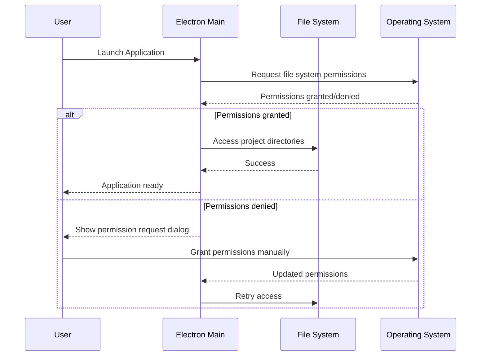

# Backend Architecture

## Service Architecture (Serverless/Function-based via Electron Main Process)

### Function Organization
```
src/main/
├── services/               # Core business logic services
│   ├── project-scanner.ts
│   ├── agent-discovery.ts
│   ├── command-executor.ts
│   └── conversation-manager.ts
├── handlers/               # IPC message handlers
│   ├── project-handlers.ts
│   ├── command-handlers.ts
│   └── conversation-handlers.ts
├── utils/                  # Shared utilities
│   ├── file-utils.ts
│   ├── process-utils.ts
│   └── database-utils.ts
└── main.ts                # Electron main entry point
```

### Function Template
```typescript
// Electron main process service
export class CommandExecutorService {
  private activeExecutions = new Map<string, ChildProcess>();

  async executeCommand(
    projectId: string,
    command: string,
    agentId?: string
  ): Promise<{ executionId: string }> {
    const executionId = generateId();
    const projectPath = await this.getProjectPath(projectId);

    const childProcess = spawn(command, {
      cwd: projectPath,
      shell: true,
      stdio: ['pipe', 'pipe', 'pipe']
    });

    this.activeExecutions.set(executionId, childProcess);

    // Stream output to renderer
    childProcess.stdout?.on('data', (data) => {
      this.sendToRenderer('command:output', {
        executionId,
        type: 'stdout',
        data: data.toString()
      });
    });

    childProcess.stderr?.on('data', (data) => {
      this.sendToRenderer('command:output', {
        executionId,
        type: 'stderr',
        data: data.toString()
      });
    });

    childProcess.on('exit', (code) => {
      this.sendToRenderer('command:output', {
        executionId,
        type: 'exit',
        data: '',
        exitCode: code ?? -1
      });
      this.activeExecutions.delete(executionId);
    });

    return { executionId };
  }

  cancelExecution(executionId: string): boolean {
    const process = this.activeExecutions.get(executionId);
    if (process) {
      process.kill('SIGTERM');
      this.activeExecutions.delete(executionId);
      return true;
    }
    return false;
  }
}
```

## Database Architecture

### Schema Design
```sql
-- Already defined in Database Schema section above
-- This section references the SQLite schema for consistency
```

### Data Access Layer
```typescript
// Repository pattern for database access
export class ConversationRepository {
  constructor(private db: sqlite3.Database) {}

  async saveMessage(message: Omit<Message, 'id'>): Promise<string> {
    const id = generateId();
    const stmt = this.db.prepare(`
      INSERT INTO messages (id, conversation_id, type, content, timestamp, agent_id, command_exit_code)
      VALUES (?, ?, ?, ?, ?, ?, ?)
    `);

    return new Promise((resolve, reject) => {
      stmt.run([
        id,
        message.conversationId,
        message.type,
        message.content,
        message.timestamp.toISOString(),
        message.metadata?.agentId || null,
        message.metadata?.commandExitCode || null
      ], function(err) {
        if (err) reject(err);
        else resolve(id);
      });
    });
  }

  async searchMessages(projectId: string, query: string): Promise<SearchResult[]> {
    const stmt = this.db.prepare(`
      SELECT m.id, m.conversation_id, m.content, m.timestamp,
             snippet(messages_fts, 0, '<mark>', '</mark>', '...', 64) as snippet
      FROM messages_fts
      JOIN messages m ON messages_fts.rowid = m.rowid
      JOIN conversations c ON m.conversation_id = c.id
      WHERE messages_fts MATCH ? AND c.project_id = ?
      ORDER BY rank
      LIMIT 50
    `);

    return new Promise((resolve, reject) => {
      stmt.all([query, projectId], (err, rows) => {
        if (err) reject(err);
        else resolve(rows as SearchResult[]);
      });
    });
  }
}
```

## Authentication and Authorization

Since this is a local desktop application, traditional authentication is not required. However, we implement security measures:

### Auth Flow


### Middleware/Guards
```typescript
// Security service for validating file system access
export class SecurityService {
  private allowedPaths = new Set<string>();

  async validateProjectPath(path: string): Promise<boolean> {
    // Ensure path is within allowed directories
    const normalizedPath = normalize(path);

    // Check for directory traversal attempts
    if (normalizedPath.includes('..')) {
      return false;
    }

    // Verify .bmad-core directory exists
    const bmadCorePath = join(normalizedPath, '.bmad-core');
    try {
      const stats = await fs.stat(bmadCorePath);
      return stats.isDirectory();
    } catch {
      return false;
    }
  }

  async validateCommandExecution(command: string, projectPath: string): Promise<boolean> {
    // Basic command validation
    const disallowedCommands = ['rm', 'del', 'format', 'mkfs'];
    const commandParts = command.toLowerCase().split(' ');

    return !disallowedCommands.some(forbidden =>
      commandParts.some(part => part.includes(forbidden))
    );
  }
}

# Unified Project Structure

Creating a monorepo structure that accommodates both the Electron main process and Angular renderer:

```
BMadUI/
├── .github/                    # CI/CD workflows
│   └── workflows/
│       ├── ci.yaml
│       └── deploy.yaml
├── apps/                       # Application packages
│   └── desktop/                # Main Electron + Angular application
│       ├── src/
│       │   ├── main/           # Electron main process
│       │   │   ├── services/
│       │   │   ├── handlers/
│       │   │   ├── utils/
│       │   │   └── main.ts
│       │   └── renderer/       # Angular renderer process
│       │       ├── app/
│       │       │   ├── core/
│       │       │   ├── shared/
│       │       │   ├── features/
│       │       │   └── layouts/
│       │       ├── assets/
│       │       └── main.ts
│       ├── electron/           # Electron configuration
│       │   ├── preload.ts
│       │   └── builder-config.js
│       ├── dist/               # Build output
│       └── package.json
├── libs/                       # Shared packages
│   ├── shared/                 # Shared types/utilities
│   │   ├── src/
│   │   │   ├── interfaces/     # TypeScript interfaces
│   │   │   │   ├── project.interface.ts
│   │   │   │   ├── message.interface.ts
│   │   │   │   └── ipc.interface.ts
│   │   │   ├── constants/      # Shared constants
│   │   │   └── utils/          # Shared utilities
│   │   └── package.json
│   └── bmad-integration/       # BMad CLI integration layer
│       ├── src/
│       │   ├── scanner/        # Project and agent discovery
│       │   ├── executor/       # Command execution
│       │   └── types/          # BMad-specific types
│       └── package.json
├── tools/                      # Build and development tools
│   ├── build/                  # Custom build scripts
│   ├── scripts/                # Utility scripts
│   └── webpack/                # Webpack configurations
├── docs/                       # Documentation
│   ├── prd.md
│   ├── brief.md
│   └── architecture.md
├── .env.example                # Environment template
├── package.json                # Root package.json
├── workspace.json              # Workspace configuration
├── angular.json                # Angular CLI configuration
├── tsconfig.base.json          # Base TypeScript config
└── README.md
