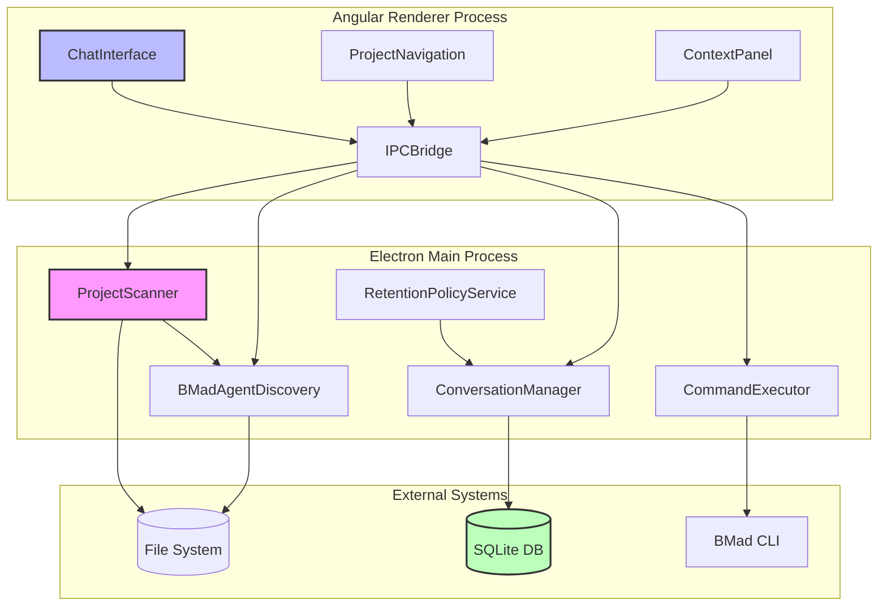

# Component Diagrams

```mermaid
graph TB
    subgraph "Electron Main Process"
        PS[ProjectScanner]
        AD[BMadAgentDiscovery]
        CE[CommandExecutor]
        CM[ConversationManager]
        RPS[RetentionPolicyService]
    end

    subgraph "Angular Renderer Process"
        CI[ChatInterface]
        PN[ProjectNavigation]
        CP[ContextPanel]
        IPC[IPCBridge]
    end

    subgraph "External Systems"
        FS[(File System)]
        DB[(SQLite DB)]
        BMAD[BMad CLI]
    end

    PS --> FS
    PS --> AD
    AD --> FS
    CE --> BMAD
    CM --> DB
    RPS --> CM

    CI --> IPC
    PN --> IPC
    CP --> IPC

    IPC --> PS
    IPC --> AD
    IPC --> CE
    IPC --> CM

    style PS fill:#f9f,stroke:#333,stroke-width:2px
    style CI fill:#bbf,stroke:#333,stroke-width:2px
    style DB fill:#bfb,stroke:#333,stroke-width:2px
```
