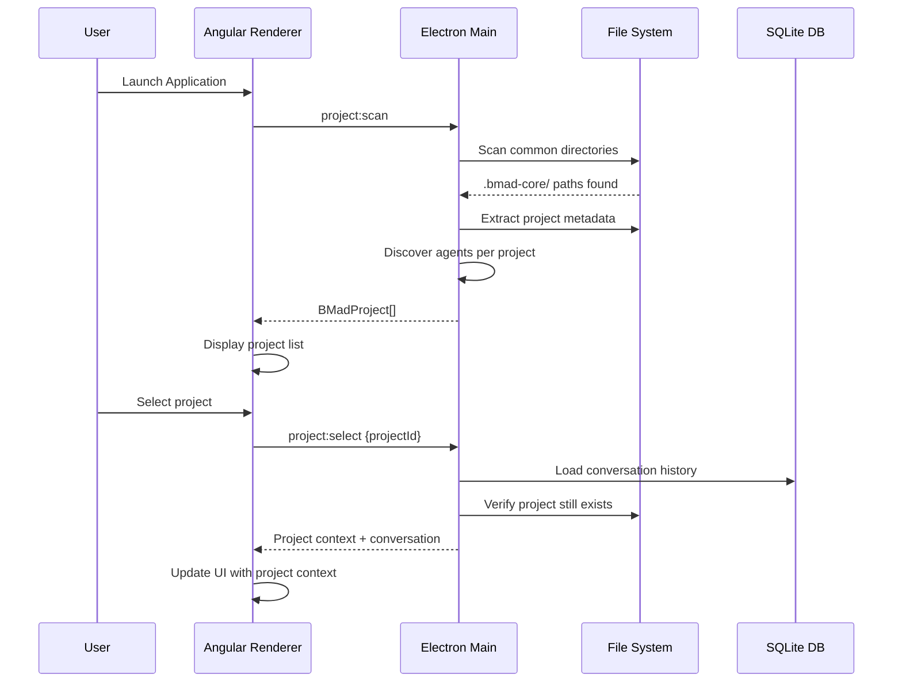
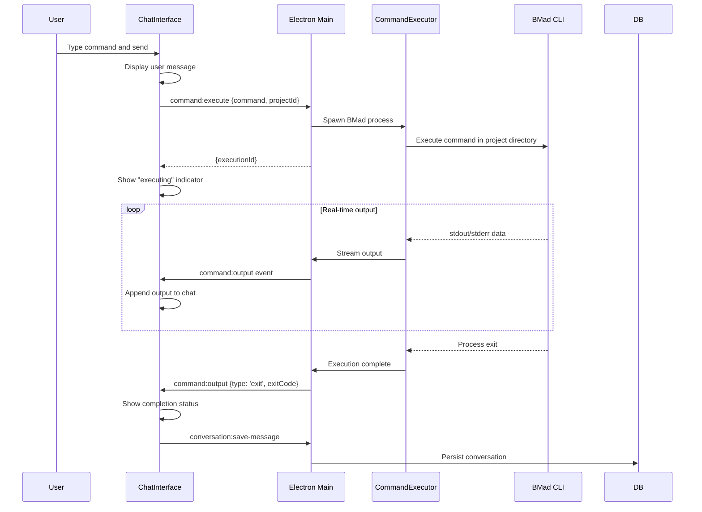
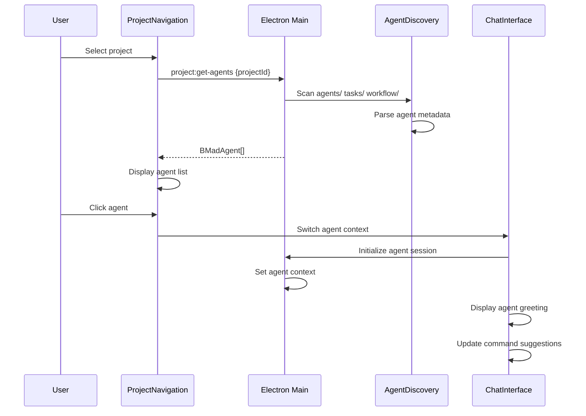
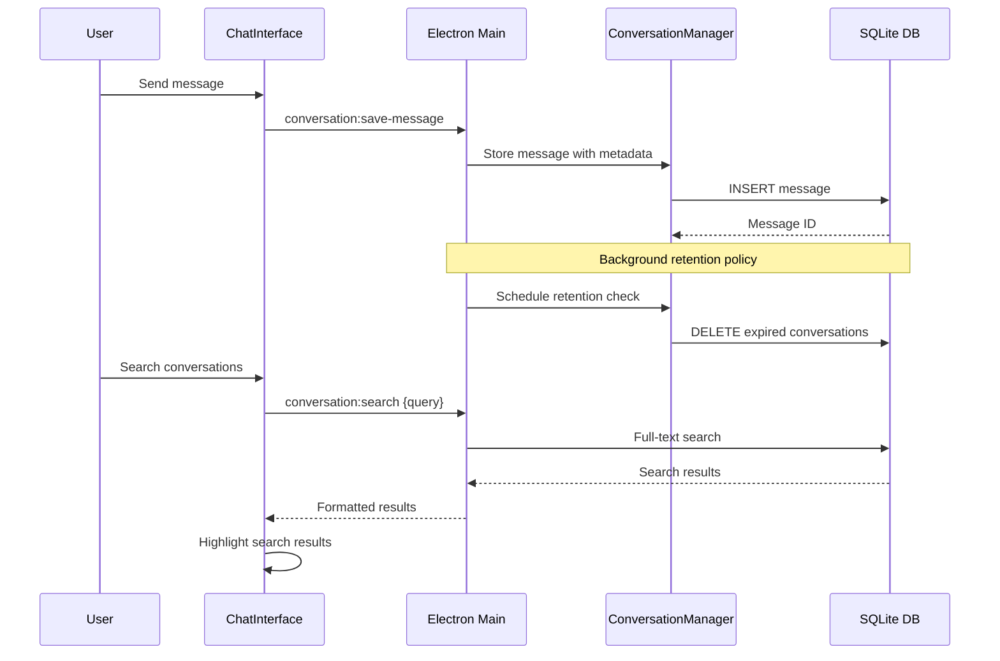
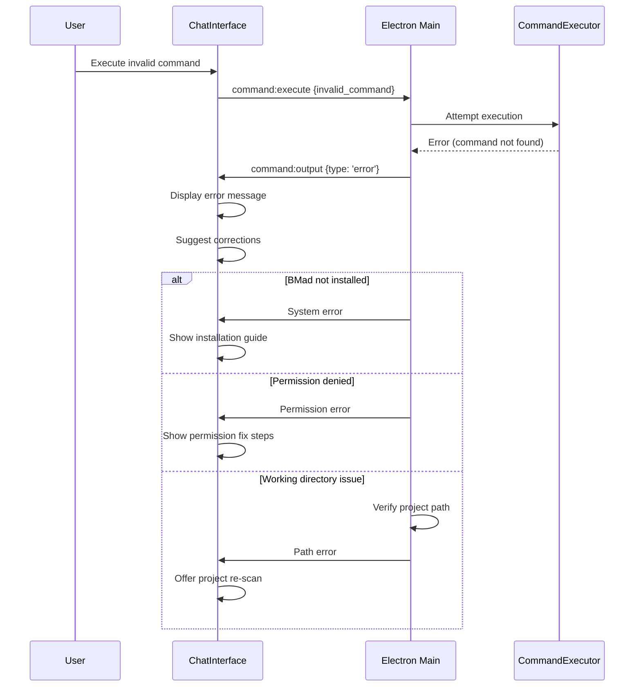

# Core Workflows

## Project Discovery and Selection Workflow

## Command Execution and Real-time Output

## Agent Discovery and Switching

## Conversation Persistence and History

## Error Handling and Recovery

