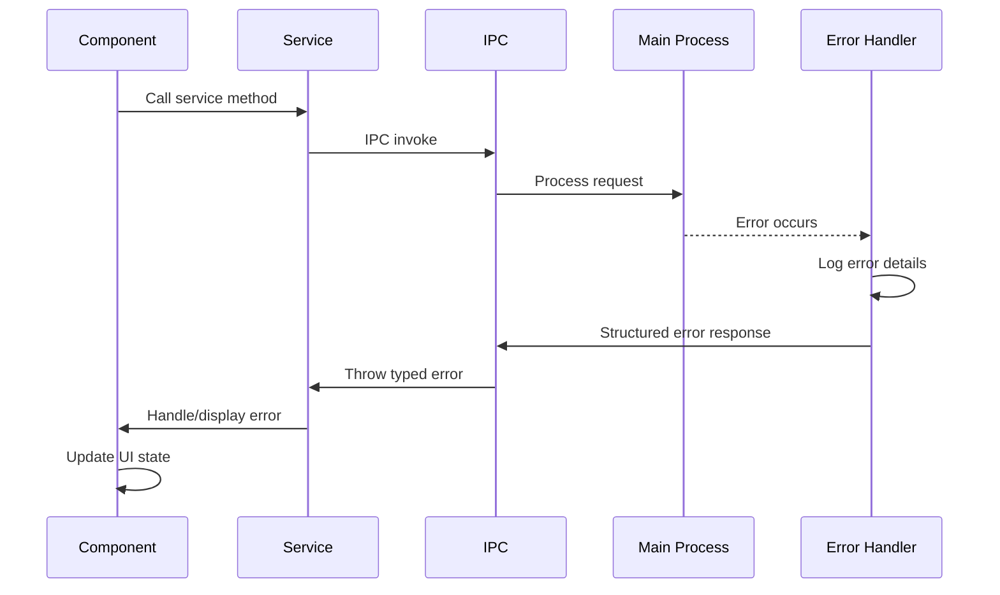

# Error Handling Strategy

## Error Flow


## Error Response Format
```typescript
interface ApiError {
  error: {
    code: string;
    message: string;
    details?: Record<string, any>;
    timestamp: string;
    requestId: string;
  };
}
```

## Frontend Error Handling
```typescript
@Injectable({ providedIn: 'root' })
export class ErrorHandlerService {
  handleError(error: ApiError): void {
    console.error('Application error:', error);

    // Display user-friendly message
    this.snackBar.open(
      this.getDisplayMessage(error.error.code),
      'Dismiss',
      { duration: 5000 }
    );

    // Log for debugging
    this.logger.error('Error details', error);
  }

  private getDisplayMessage(code: string): string {
    const messages: Record<string, string> = {
      'PROJECT_NOT_FOUND': 'Project could not be found. Please refresh the project list.',
      'BMAD_NOT_INSTALLED': 'BMad CLI is not installed. Please install BMad to continue.',
      'PERMISSION_DENIED': 'Permission denied. Please check file access permissions.',
      'COMMAND_FAILED': 'Command execution failed. Check the command and try again.'
    };
    return messages[code] || 'An unexpected error occurred.';
  }
}
```

## Backend Error Handling
```typescript
export class GlobalErrorHandler {
  static handle(error: Error, context: string): ApiError {
    const errorId = generateId();
    const timestamp = new Date().toISOString();

    // Log full error details
    logger.error(`[${errorId}] Error in ${context}:`, {
      message: error.message,
      stack: error.stack,
      timestamp
    });

    // Return sanitized error to frontend
    return {
      error: {
        code: this.getErrorCode(error),
        message: this.getSafeMessage(error),
        timestamp,
        requestId: errorId
      }
    };
  }

  private static getErrorCode(error: Error): string {
    if (error.message.includes('ENOENT')) return 'FILE_NOT_FOUND';
    if (error.message.includes('EACCES')) return 'PERMISSION_DENIED';
    if (error.message.includes('spawn')) return 'COMMAND_FAILED';
    return 'UNKNOWN_ERROR';
  }

  private static getSafeMessage(error: Error): string {
    // Return user-safe messages, hide internal details
    const safeMessages: Record<string, string> = {
      'FILE_NOT_FOUND': 'The requested file or directory was not found.',
      'PERMISSION_DENIED': 'Permission denied accessing the file or directory.',
      'COMMAND_FAILED': 'The command could not be executed.'
    };

    const code = this.getErrorCode(error);
    return safeMessages[code] || 'An internal error occurred.';
  }
}
```
