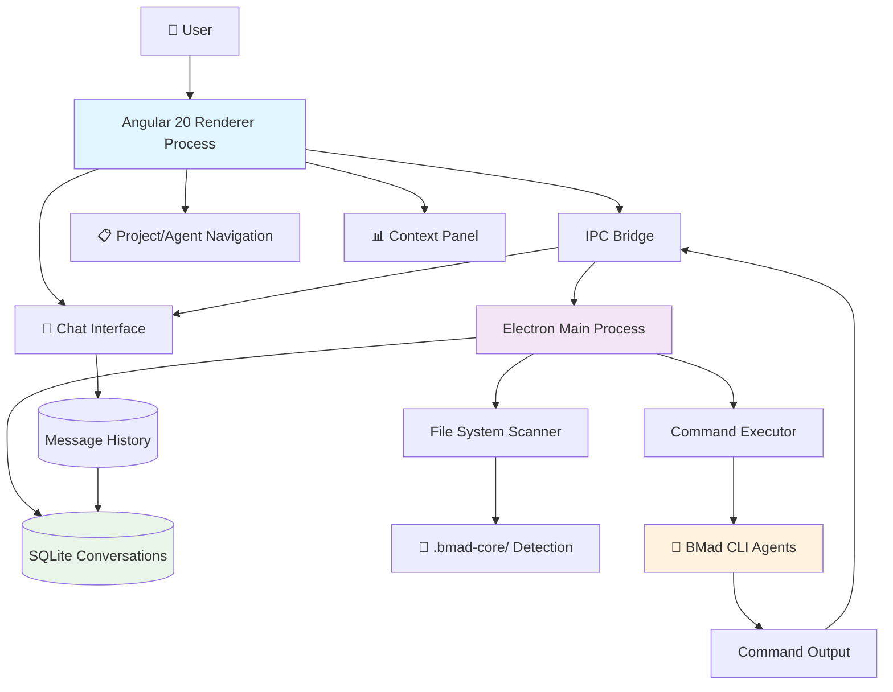

# High Level Architecture

## Technical Summary

BMad GUI employs a native desktop architecture using Electron with Angular 20+ for the renderer process, creating a hybrid application that bridges local system access with modern web UI capabilities. The frontend leverages Angular's standalone components, signals, and @defer blocks for reactive chat interfaces, while the Electron main process manages BMad CLI integration, file system operations, and SQLite conversation persistence. Key integration occurs through IPC channels that maintain working directory context and enable real-time command execution feedback. The application deploys as a cross-platform native desktop app (Windows, macOS, Linux) with complete offline capability and local-first data storage. This architecture directly addresses workflow fragmentation by unifying CLI power with conversational UX while maintaining the privacy guarantees essential for competitive development work.

## Platform and Infrastructure Choice

Based on your PRD requirements for cross-platform desktop application with local-first architecture, I'm recommending the **Desktop Native + Local Services** approach:

**Platform:** Native Desktop Application (Electron)
**Key Services:**
- Electron main process (Node.js runtime)
- Angular 20+ renderer process
- SQLite local databases per project
- File system APIs for project detection
- Child process management for BMad execution

**Deployment Host and Regions:** Local desktop deployment with distributed binaries via GitHub Releases or similar. No server infrastructure required - each installation is completely self-contained.

**Alternative considered but not recommended:**
- **Web Application**: Would require server infrastructure and compromise offline capability
- **Progressive Web App**: Lacks file system access needed for BMad integration

## Repository Structure

**Structure:** Monorepo with clear service separation
**Monorepo Tool:** npm workspaces (built into npm, no additional tooling required)
**Package Organization:**
- `apps/desktop` - Main Electron application
- `libs/shared` - Shared TypeScript interfaces and utilities
- `libs/bmad-integration` - BMad CLI integration layer
- `libs/conversation-storage` - SQLite conversation management

This structure supports your single-developer timeline while enabling future modularization if needed.

## High Level Architecture Diagram

## Architectural Patterns

- **Desktop Native Architecture:** Electron provides native OS integration while maintaining web technology benefits - _Rationale:_ Balances development speed with native desktop capabilities required for file system access
- **Reactive UI with Signals:** Angular signals for state management with RxJS for async operations - _Rationale:_ Optimal performance for real-time chat interfaces and command execution feedback
- **Local-First Data Storage:** SQLite per-project with no external dependencies - _Rationale:_ Ensures privacy guarantees and offline capability essential for competitive development work
- **Process Separation Pattern:** Main process handles system integration, renderer focuses on UI - _Rationale:_ Leverages Electron's security model while enabling rich UI interactions
- **Command Execution Context Preservation:** Maintain working directory state across command invocations - _Rationale:_ Essential for BMad CLI compatibility and user workflow continuity
- **IPC Message Queuing:** Structured communication between processes with error handling - _Rationale:_ Ensures reliable command execution and real-time UI updates
